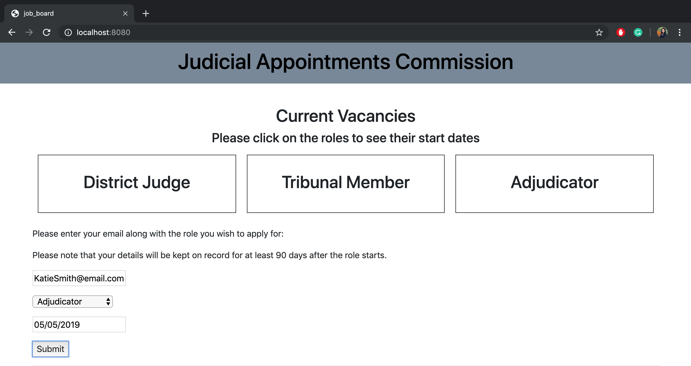
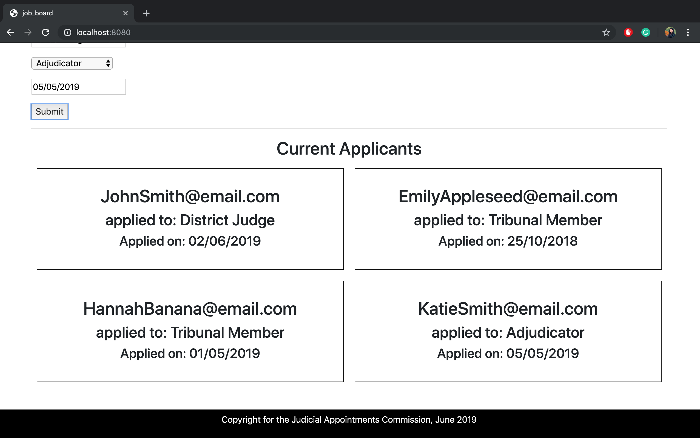

# JobBoard

##About
JobBoard is a project I worked on for a tech test for the Judicial Appointments Commission. I used Vue.js (a framework I had never looked at or touched before this), to make this single page web app.

## Installation
Please see the README in the job_board file for full instructions on installation, booting up, and running tests.

##Purpose
- JobBoard is a single page web application, designed to help the Judicial Appointments Commission keep track of applicants who are interested in their vacancies.
- Once JobBoard is installed, and the server is fired up, a user can browse current jobs available, and click to see the start date of each role. Users can also enter their email, the role they're interested in, and the date of applying. A record of their interest will be kept under the current applicants section.

## Tests
I used Cypress for the E2E tests, and Mocha for the Unit tests. See the job_board README for instructions on how to run.

## Technology

- JavaScript
- Vue.js
- Mocha with Chia, Cypress
- Bootstrap

## Reflections

### Research
When I received the details of the tech test, I set myself the VERY ambitious task of using Vue.js to complete the test, in order to align to the tech that the developers at JAC use. I felt that this would give me an exciting challenge, and give the panel a chance to see something that would in order to truly reflect my skills in the role. Before this, I had never touched Vue.js or any javascript framework to be honest, but I really wanted to give this test my all so I decided to plan and research as much as I could before sitting the test. I found Vue to be a really interesting topic, and the MVVM set up to be a very different concept than to what I'm used to with Ruby.

### Completing
I felt that the test went fairly well, and I'm happy with my accomplishments. I must say, I'm quite proud of myself for learning the ins and outs of a completely new framework in a couple of days. I took a mix of BDD and TDD approach with this task. I would use BDD in sandbox or codepen to practice the code I wanted to use, then TDD to implement it into my project. This was the best approach for me, as I didn't know how Vue.js worked and needed to play around with to understand what I was putting in my project. I also decided to switch up my usual process, and focus on developing the front end first. This isn't my usual approach, as normally I would develop the business logic and fit a front end around it, however I felt that seeing the outcome of my code would help me visualise how Vue.js worked a bit more easily. I used Cypress and Mocha with Chia to test, which again are testing technologies that I've never used before. Cypress was really nice to use actually, but I found unit testing the project a little bit confusing. This isn't a completed task, but I felt I have covered the MVP.

#### What went well
In a nutshell:
- Learning Vue.js went incredibly well given the timeframe. I'm confident I know how the code I write appears on the page.
- E2E testing also went well, again considering I didn't know it beforehand. I feel like my tests cover all aspects of the page, but I also feel they could have been written a bit better.
- The planning and diagramming of this project went well. My diagrams definitely evolved over time the more I understood the concepts, but planning what I wanted to happen helped a lot.

#### What I could have improved on
There's a lot of things I could have improved on if I had the time, as this is no way near to being finished.
In a nutshell:
- Functionality: I would have liked the roles on the drop down list to not be hard coded into the App's data. With TDD, you do the smallest thing first to make the test green, so hard coding was the one to fix that. For a short solution, there was an options feature I wanted to look into. For a long term solution, I would have investigated into using Firebase/Firestore to hold all the info.

- Functionality: I would have also liked to implement a database that holds the User info as well, as currently the applicant data is lost when the page gets refreshed. For a short term solution, I would have looked into the Vue.js version of sessions to see if I could record user data. For a long term solution, I would have included the User information on the database so that users didn't have to make an account.

- Functionality: I would have also liked to investigate into Routers. I felt that given the short time frame, it was more important to cover the basics, however it would make more sense for the applicants not to see each others email addresses and role choices... there's all sorts of GDPR issues with that. For a short term solution, I would have made a separate page for the recruitment team to look at, that holds the data within the 'current applicants' section. For a long term solution, I would have recorded this in a DB, that could have the data exported for followup.

- Testing: My E2E tests could have been a bit more comprehensive. While I haven't got experience with Cypress, I do have previous experience with other testing tech for Ruby. I feel like my E2E tests only check if content is on a page, and some of these tests could potentially not be testing what I want them to test. If I had more time, I would investigate a bit more into Cypress, as well as best testing practices.

- Testing: My Unit tests definitely could have been more comprehensive. I ran out of time when unit testing, as I only started to implement the business logic after the front end was mostly set up. The resources I found around testing with Mocha and Chia were a bit inconclusive, and also seemed to test more of the front end things I had tested with Cypress. Given more time, I would investigate a lot more into Unit testing in Vue.js, and into what the best testing practices are.

# Conclusion

I had an awful lot of fun learning Vue for this test. I also found the topic to be quite interesting. I've given my best efforts into this project, and had to adapt my usual process accordingly. After this project, I feel I have at least a basic understanding of Vue.js, and could explain my code with moderate confidence. 
